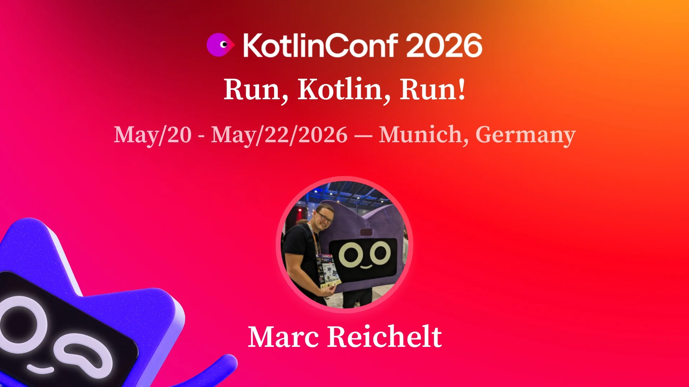

# Talk: Run, Kotlin, Run!

Talk for [KotlinConf 2026](https://kotlinconf.com/speakers/839e3da7-2b28-479f-bddc-bf20c585ef3d/).

- Slides: [PDF](Marc%20Reichelt%20-%20KotlinConf%202026%20-%20Run,%20Kotlin,%20Run.pdf)
- [KotlinConf video recording](https://www.youtube.com/watch?v=-w97euRLTBA)

## Talk Description

JVM, native, JS, WebAssembly - it's hard to keep track on the many ways where we can run Kotlin these days. So here's a challenge: find as many ways to run Kotlin in a lightning talk as we can! The more exotic, the better!

## Contact

- [BlueSky: mreichelt](https://bsky.app/profile/mreichelt.bsky.social)
- [Mastodon: mastodon.social/@mreichelt](https://mastodon.social/@mreichelt)
